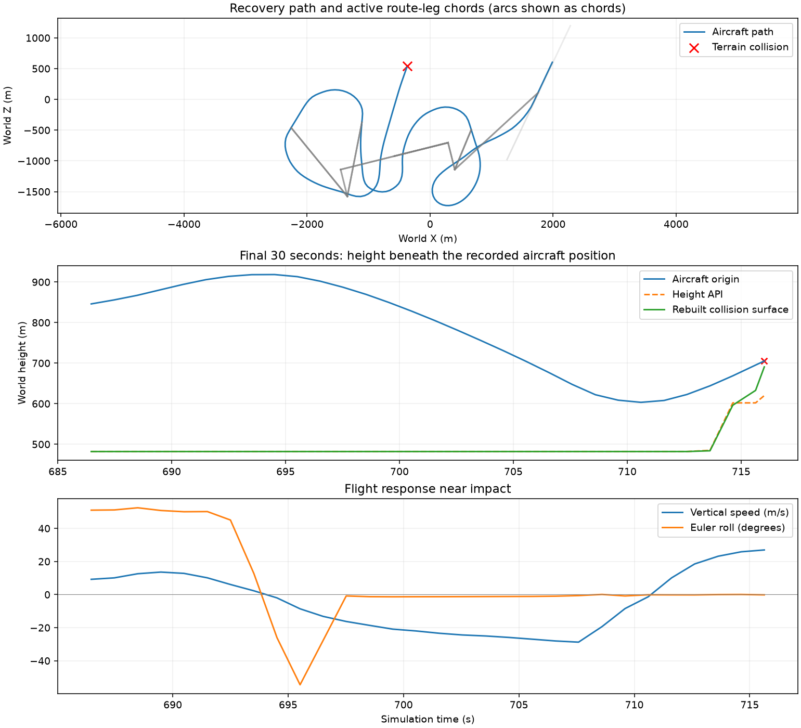

# Sortie recovery diagnosis — 2026-09-18

Two concrete defects were isolated: terrain queries disagree with the generated collision surface, and a roll-in safeguard can suppress an early wings-level terrain climb. The latter has a narrow code repair and focused regression coverage. Operational recovery remains unvalidated after that repair.

## Terrain reconstruction

`Tests/SortieTerrainReconstruction.gd` rebuilds the recorded terrain frame and relevant chunks from the scene configuration, seed 22551, open_canyons profile and recorded terrain position `(22618.79, 62, 3722.299)`. All **215 reconstructed height-API samples exactly match the recorded height samples** from the recovery trace. The impact falls in the recorded collision chunk `(26, 46)`.

At the aircraft origin at impact:

| Measurement | World height |
| --- | ---: |
| Aircraft origin | 705.30 m |
| Public height API | 620.00 m |
| Rebuilt collision surface, vertical ray | 690.69 m |
| Actual origin clearance over rebuilt mesh | 14.61 m |
| Apparent clearance using height API | 85.30 m |

Six metres farther along world Z, the collision surface reaches 705.93 m, above the aircraft origin. This is consistent with a wing hitting a steep rising surface while the centre-point height query appears safe. The exact contact point/normal and crash-frame orientation were not saved; this is geometry reconstruction, not an exact rigid-body contact replay.

`LowPolyTerrain.get_height()` samples `_sample_height()` and rounds it. `_build_chunk_arrays()` also applies cliff-planform straightening/jitter, relaxation, washboard suppression and triangulation; the collision body uses those generated triangles. The two representations are not equivalent near cliffs. The measured discrepancy does not by itself identify how much each processing step contributed.

The next terrain repair should establish a shared representation for collision and safety/navigation queries, including unstreamed look-ahead samples. Simply raising the aircraft, reducing collision sensitivity or adding a constant clearance offset would conceal the mismatch. A raycast-only fallback would still leave unstreamed route planning inconsistent.

## Flight path and climb demand

Recovery entered at 505.35 s. Three progress failures led to reacquisition/replanning. Across reconstructed route revisions 3–6, cross-track error reached approximately 617, 1,474, 991 and 741 m respectively. Only 8 of the 215 sampled recovery positions were marked as tracking the checked corridor. The original telemetry contains progress and segment endpoints, but not the complete planned arcs or controller state; it does not establish whether every original planned turn was dynamically feasible.

In the final turn/descent, aircraft altitude fell from about 914 m to 603 m. At 701.55 s the terrain-climb floor was already +16.48 m/s while actual vertical speed was −23.38 m/s and pitch command was −0.030. At 704.57 s the floor was +28.54 m/s, actual vertical speed −25.90 m/s and pitch command −0.014. Strong pull appeared by 707.58 s; by impact the aircraft was climbing, but too late to clear the rising terrain.

## Narrow control repair

In `AIPilot._compute_coordinated_turn_controls()`, `bank_established_t` waits for a bank to develop before allowing turn load. At wings level it stays zero: the subsequent blend caps the load request at 1 G and elevator at 0.08. Formation and emergency recovery already have explicit exceptions, but an early normal-route terrain climb did not.

`Tests/RecoveryClimbAuthorityProbe.gd` isolated a +16 m/s climb demand, −23 m/s descent and supplied 2.5 G load. Before the repair, normal route control requested 1 G and neutral pitch; enabling the existing emergency escape requested 2.5 G and positive pitch. This reproduces the suppression mechanism, not the complete original aircraft/controller state.

The repair allows the early terrain climb to retain its supplied vertical load only when:

- the pilot is in a recovery-route state;
- a positive finite terrain-climb floor is active and the vertical command respects it;
- both actual and requested bank are below 8 degrees.

Ordinary no-terrain control and an unestablished 40-degree turn retain the existing roll-in safeguard. Existing useful-AoA/load limits and landing gates remain active. The regression probe checks all four paths (early terrain climb, ordinary level control, pending bank and emergency escape). `RecoveryTerrainEscapeSmoketest` also passes. These are controller/state checks; a physical post-repair full sortie has not been run.

## Matched authority comparison, before the narrow repair

Six prepared turn-in cases were rerun for each reference speed in calm air. Entry dictionaries, carrier transforms, aircraft positions, velocities, mass and wind state match exactly for all six pairs.

| Reference speed | Right entries at 50/60/70 m/s | Left entries at 50/60/70 m/s | Confirmed catches and stops |
| --- | --- | --- | ---: |
| 70 m/s | All waved off | All caught and stopped | 3/6 |
| 100 m/s | All waved off | All waved off | 0/6 |

This supports retaining the revised 70 m/s reference. It does not prove reliable recovery or attribute the full-sortie terrain collision to a particular control setting. These are single attempts per prepared case, using the existing quick-turn diagnostic harness and its diagnostic final handoff, not a replay of the failed operational arrival or a wind acceptance test. All comparison runs finished before the new climb-control repair was applied.

## Artifacts and remaining work

- `logs/sortie_terrain_reconstruction.json`: geometry measurements and recovered telemetry.
- `logs/sortie_recovery_reconstruction.csv` and `.png`: time series and plot.
- `logs/recovery_climb_authority_probe.log`: before-repair controller probe.
- `logs/recovery_climb_authority_fixed.log`: passing regression after repair.
- `logs/recovery_terrain_escape_check.log`: passing existing regression.
- `captures/authority_reduced_calm_turn_sortie{70,100}_{samples.jsonl,result.json}`: matched comparisons.
- `logs/sortie_compare{70,100}.log`: comparison stdout.

Imported-scene, dummy-renderer and shutdown resource warnings remain. No SCRIPT ERROR occurred in the completed comparison/regression runs. An initial reconstruction-script type inference error was corrected before the reconstruction completed.

Repair terrain-height consistency next, then rerun physical off-route descent/escape and operational recovery with full route/controller telemetry. Persistent right-side turn-in failures require separate guidance analysis. The strike's target selection, weapon release and accuracy are still a separate unresolved investigation.

## Follow-up: terrain correction

The public scalar and batch height queries now use the processed collision surface. The original crash geometry is preserved, and the mismatch is below 1 mm in the recorded-area comparisons. See [implementation, validation and operational rerun](TERRAIN_SURFACE_CONSISTENCY_2026-09-18.md). The earlier findings above describe the original run.
